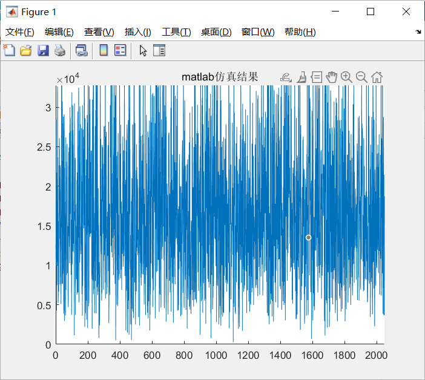
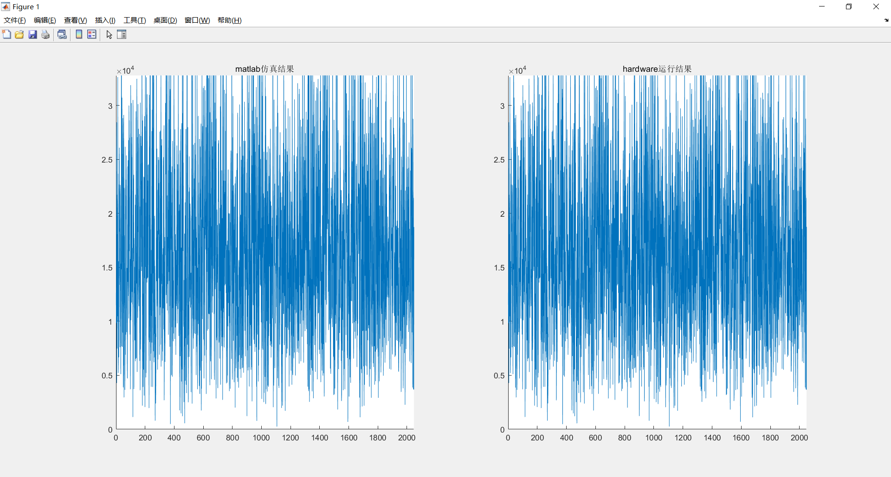

# CCFSys CCC 2023
这个仓库用于存储ccc所用到的程序及文件。  
This repository is used to store the code and files about the ccc .   

## Tools Versions  
采用的是本地VCK5000板卡进行运行测试，具体环境设置如下所示。  
This version of the tutorial has been verified for the following environments. 

| Environment  | Vitis   |    XRT   | Shell | Notes |
|--------------|---------|----------|-------|-------|
| VCK5000      | 2022.2  | 2.14.384  | xilinx_vck5000_gen4x8_qdma_2_202220_1|  |  

## Problem FFT  
- Basic - 1024-Point FFT Single Kernel Programming  
 The basic requirement is to complete a 1k-Point FFT design based on personal understanding using AIE API or AIE Intrinsic.
 
- Advanced - Explore very large point FFT (8k ~ 64k points) design on VCK5000

## Submission File Tree  
├── aie  
│ &nbsp;&nbsp;&nbsp;&nbsp;&nbsp;&nbsp;├── data  
│ &nbsp;&nbsp;&nbsp;&nbsp;&nbsp;&nbsp;│&nbsp;&nbsp;&nbsp;&nbsp;&nbsp;&nbsp;├── inputa_float.txt  
│ &nbsp;&nbsp;&nbsp;&nbsp;&nbsp;&nbsp;│&nbsp;&nbsp;&nbsp;&nbsp;&nbsp;&nbsp;├── ref_outputc_float.txt  
│ &nbsp;&nbsp;&nbsp;&nbsp;&nbsp;&nbsp;├── Makefile  
│ &nbsp;&nbsp;&nbsp;&nbsp;&nbsp;&nbsp;└── src  
│ &nbsp;&nbsp;&nbsp;&nbsp;&nbsp;&nbsp;&nbsp;&nbsp;&nbsp;&nbsp;&nbsp;&nbsp;&nbsp;&nbsp;├── fft.hpp  
│ &nbsp;&nbsp;&nbsp;&nbsp;&nbsp;&nbsp;&nbsp;&nbsp;&nbsp;&nbsp;&nbsp;&nbsp;&nbsp;&nbsp;├── graph.cpp  
│ &nbsp;&nbsp;&nbsp;&nbsp;&nbsp;&nbsp;&nbsp;&nbsp;&nbsp;&nbsp;&nbsp;&nbsp;&nbsp;&nbsp;├── graph.hpp  
├── build.hw   
│ &nbsp;&nbsp;&nbsp;&nbsp;&nbsp;&nbsp;└── dsplab.xclbin  
├── host  
│ &nbsp;&nbsp;&nbsp;&nbsp;&nbsp;&nbsp;├── host.cpp  
│ &nbsp;&nbsp;&nbsp;&nbsp;&nbsp;&nbsp;├── Makefile  
│ &nbsp;&nbsp;&nbsp;&nbsp;&nbsp;&nbsp;└── input.txt  
├── hw_link  
│ &nbsp;&nbsp;&nbsp;&nbsp;&nbsp;&nbsp;└── config.cfg  
├── Makefile  
└── pl  
 &nbsp;&nbsp;&nbsp;&nbsp;&nbsp;&nbsp;&nbsp;&nbsp;├── Makefile  
 &nbsp;&nbsp;&nbsp;&nbsp;&nbsp;&nbsp;&nbsp;&nbsp;└── src  
 &nbsp;&nbsp;&nbsp;&nbsp;&nbsp;&nbsp;&nbsp;&nbsp;&nbsp;&nbsp;&nbsp;&nbsp;&nbsp;&nbsp;&nbsp;&nbsp;├── config.hpp  
 &nbsp;&nbsp;&nbsp;&nbsp;&nbsp;&nbsp;&nbsp;&nbsp;&nbsp;&nbsp;&nbsp;&nbsp;&nbsp;&nbsp;&nbsp;&nbsp;├── mm2s.cpp  
 &nbsp;&nbsp;&nbsp;&nbsp;&nbsp;&nbsp;&nbsp;&nbsp;&nbsp;&nbsp;&nbsp;&nbsp;&nbsp;&nbsp;&nbsp;&nbsp;└── s2mm.cpp  
  
 
## AIEemu  
aie中data文件夹包含仿真所用到的输入数据和参考输出，src文件夹包含所用到的kernel及头文件，makefile用于编译文件及进行相应的仿真。  
以下是具体的仿真运行步骤：  
1.在aie文件夹下打开终端 

2.在终端中输入
```
make all
```

3.成功创建build.hw文件夹及内部libadf.a等文件  

4.在终端中输入  
```
make aieemu
```

5.运行结束后可在build.hw中的aiesimulation_output文件夹中得到仿真输出结果  

## MATLAB result  
将input.txt文件中的点的数据利用MATLAB程序进行FFT操作，具体运行代码如下：

```
%利用MATLAB进行FFT并绘制相应频率响应图像

aie_data_input = importdata("input.txt");
FFT_data_in = aie_data_input(:,1)+aie_data_input(:,2)*i;
FFT_data_out = fft(FFT_data_in);
plot(1:length(FFT_data_out),abs(FFT_data_out));
```
以下是结果图像  
     
   
## AIE hardware run  
input.txt输入数据 第一个数表示fft点的实部 空格 第二个点表示fft的虚部。  
以下是具体的运行步骤：  
1.在最外层文件夹下打开终端输入
```
make all
```
对整个程序进行hardware编译，最终得到.xclbin文件。  

2.完成.xclbin文件的创建后，在终端中进入host文件夹
```
cd host
```  
可以在host文件夹中看到生成的dsplib.exe可执行文件  

3.在终端中输入以下指令对输入数据进行FFT操作  
```
./dsplib.exe -i input.txt
```
利用本地VCK5000运行程序后，可以在host文件夹下得到FFT后的输出文件output.txt  


## Result compare  

将上述aieemu得到的FFT后的输出，MATLAB中的FFT结果以及hardware运行后的结果进行比较。  

aieemu的输出文件命名为FFT_out_aieemu.txt（需要注意的是 此处的数据需要进行一定的处理）   
hardware的输出文件命名为FFT_out_hardware.txt  

MATLAB程序如下所示  

```
%利用MATLAB绘制不同的结果图像并进行比较分析
clear;clc;

aie_data_input = importdata("input.txt");
FFT_data_in = aie_data_input(:,1)+aie_data_input(:,2)*i;
FFT_out_matlab = fft(FFT_data_in);


FFT_out_aieemu_txt = importdata("FFT_out_aieemu.txt");
FFT_out_aieemu = FFT_out_aieemu_txt(:,1)+FFT_out_aieemu_txt(:,2)*i;
FFT_out_hardware_txt = importdata("FFT_out_hardware.txt");
FFT_out_hardware = FFT_out_hardware_txt(:,1)+FFT_out_hardware_txt(:,2)*i;
L_fft=length(FFT_data_in);

% figure(1)
% subplot(1,3,1)
% title("aieemu仿真结果");
% plot(1:length(FFT_out_aieemu),abs(FFT_out_aieemu));

subplot(1,2,1)
title("matlab仿真结果") 
hold on
plot(1:length(FFT_out_matlab),abs(FFT_out_matlab));
axis([0 L_fft 0 32768])

subplot(1,2,2)
title("hardware运行结果")
hold on
plot(1:length(FFT_out_hardware),abs(FFT_out_hardware));
axis([0 L_fft 0 32768])

X=abs(FFT_out_matlab)-abs(FFT_out_hardware);

figure(2)
title("hardware运行结果")
hold on
plot(1:length(FFT_out_hardware),X);
```  
通过比较aieemu与hardware所得到的结果 两者一致 所以只比较hardware与matlab的结果的不同  
     
     

## Reference  
1. xup_aie_training-main/sources/dsplib_lab
2. xup_aie_training-main/sources/Vitis_Libraries
3. vck5000_mixed_kernel_integration-2022.2/vck5000_mixed_kernel_integration-master
4. Block-by-Block Configurable Fast Fourier Transform Implementation on AI Engine (XAPP1356)
5. 
